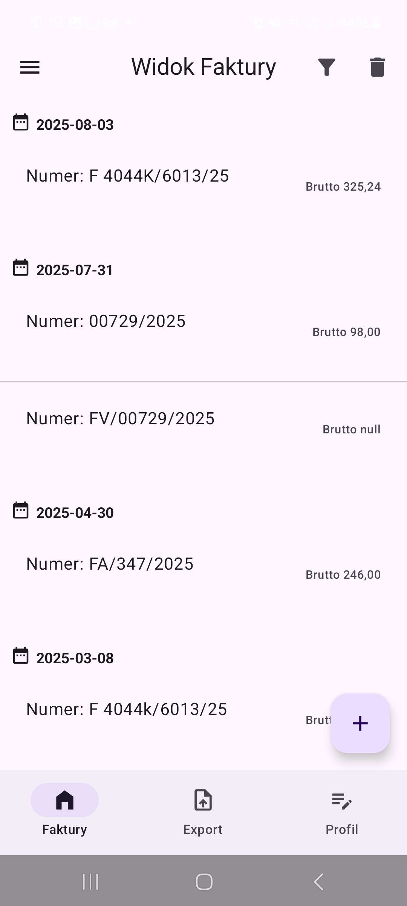
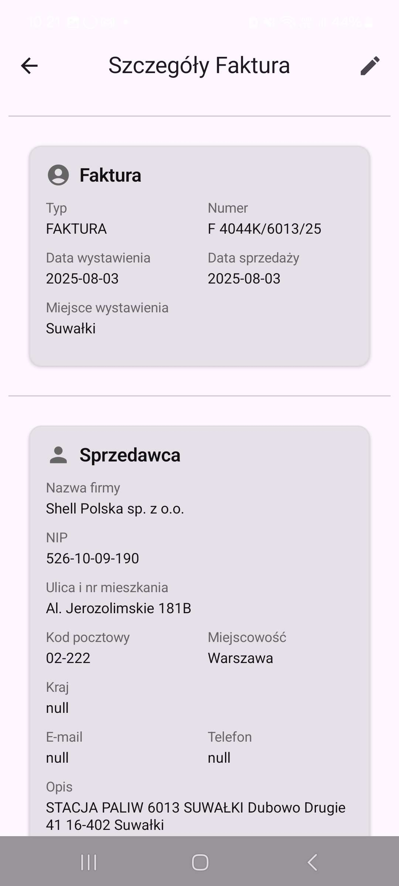
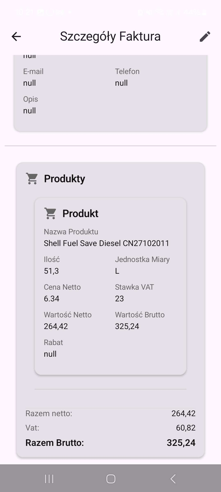
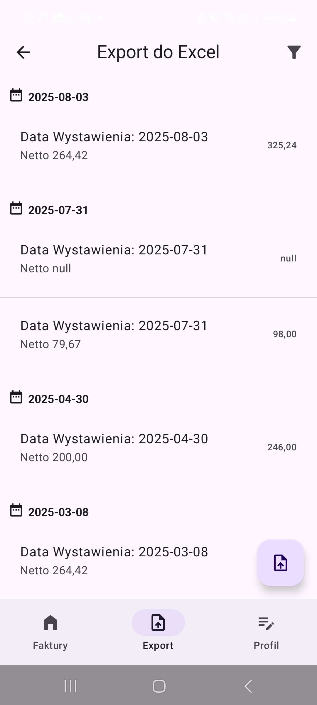
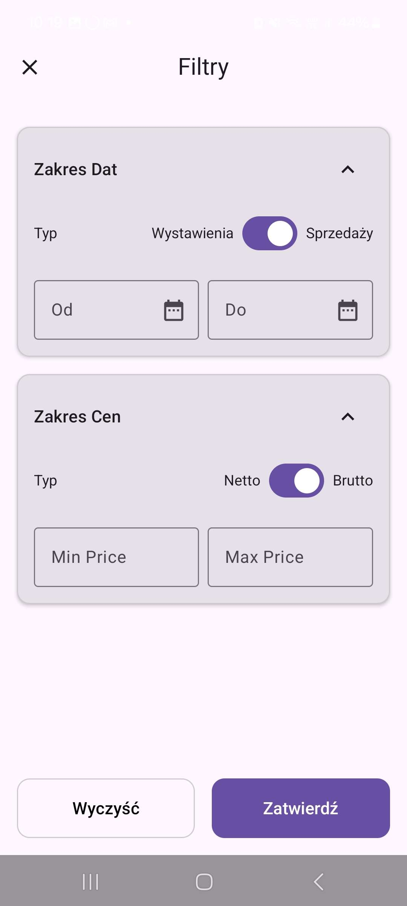
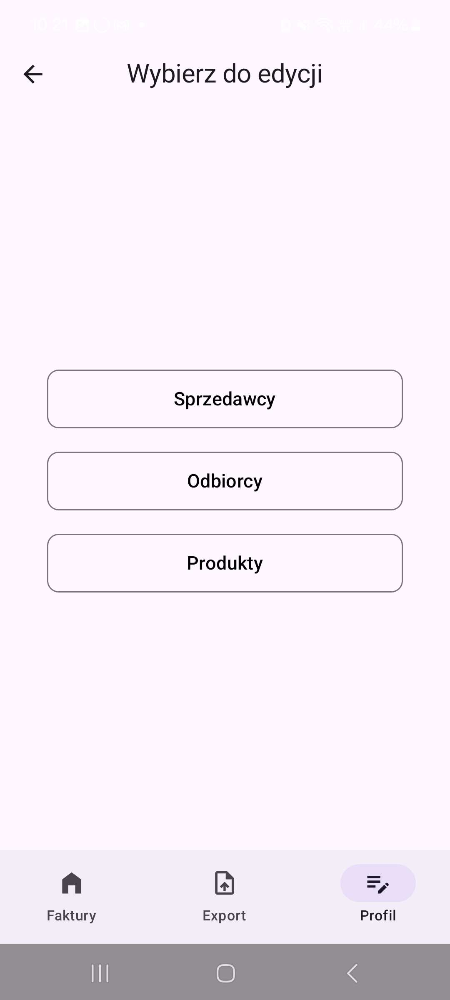
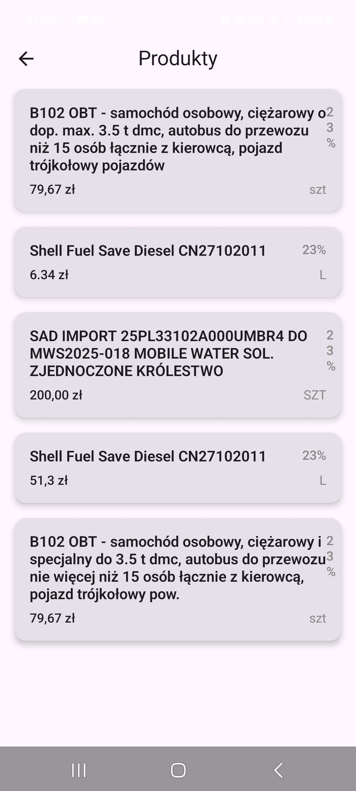

# 📷 Untitled Photo App (Scanner) for Android

## Description
An Android app built with **Kotlin** and **Jetpack Compose** for scanning, managing, and exporting invoices.  
Users can take a photo of an invoice, let AI read and parse the data, and then approve it before saving.

---

## Motivation
This project was created for people who receive a large number of invoices and need to enter them into their system manually. The app streamlines this process by scanning invoices with the camera, parsing them with AI, and allowing quick management and export to Excel.

---

## Features
- 📸 **Scan invoices** with the device camera
- 🗂 **Manage invoices** (CRUD operations)
- 📑 **Export data** to Excel

---

## Tech Stack
- **Kotlin** with **Jetpack Compose**
- **CameraX** (camera integration)
- **Coil** (image loading)
- **Room** (local database)
- **Retrofit** + **Gson** (API communication)
- **Hilt** (dependency injection)
- **Generative AI API** (invoice recognition & parsing)
- **Apache POI** (Excel export)
- **JUnit / Espresso / Robolectric / MockK** (testing)

---

## Project Structure

📂 app/src/main/java/com/example/photoapp
 ┣ 📂 app
 ┃ ┣ 📜 MainActivity.kt         # Main entry point of the app
 ┃ ┗ 📜 AppApplication.kt       # Application class (Hilt initialization)
 ┣ 📂 core
 ┃ ┣ 📂 ai                      # AI integration (invoice recognition, parsing)
 ┃ ┣ 📂 components              # Reusable UI components (Jetpack Compose)
 ┃ ┣ 📂 navigation              # Navigation graph & routes
 ┃ ┗ 📂 utils                   # Utility classes & extensions
 ┣ 📂 features
 ┃ ┣ 📂 captureFlow             # Camera & invoice scanning flow
 ┃ ┣ 📂 excelPacker             # Excel export using Apache POI
 ┃ ┣ 📂 faktura                 # Invoice CRUD operations
 ┃ ┣ 📂 filterScreen            # Invoice filtering & search
 ┃ ┣ 📂 login                   # Authentication flow
 ┃ ┣ 📂 odbiorca                # Buyer/receiver module
 ┃ ┣ 📂 produkt                 # Product module
 ┃ ┣ 📂 selector                # Item/document selector
 ┃ ┗ 📂 sprzedawca              # Seller module
 ┗ 📜 (other core files)

## Tests

📂 app/src/test/java/com/example/photoapp
┗ 📜 Unit tests

- ✅ **189 unit tests**
- 📊 **97% coverage**~~

---

## Future Improvements
- 📌 Batch invoice import (e.g., process 10 at once)
- 📌 Multi-language OCR support

---

## Screenshots

<table>
  <tr>
    <td align="center" width="25%">
      <b>Login Screen</b> 
      
    </td>
    <td align="center" width="25%">
      <b>Invoice Screen</b> 
      
    </td>
    <td align="center" width="25%">
      <b>Invoice Details 1</b> 
      
    </td>
    <td align="center" width="25%">
      <b>Invoice Details 2</b> 
      
    </td>
  </tr>
  <tr>
    <td align="center" width="25%">
      <b>Export Excel</b> 
      
    </td>
    <td align="center" width="25%">
      <b>Filters</b> 
      
    </td>
    <td align="center" width="25%">
      <b>Selector Screen</b> 
      
    </td>
    <td align="center" width="25%">
      <b>Selector Products</b> 
      
    </td>
  </tr>
</table>

---

## Author
👤 **Stanisław Dolaziński**  
📧 [sdolazinski@gmail.com](mailto:sdolazinski@gmail.com)  
